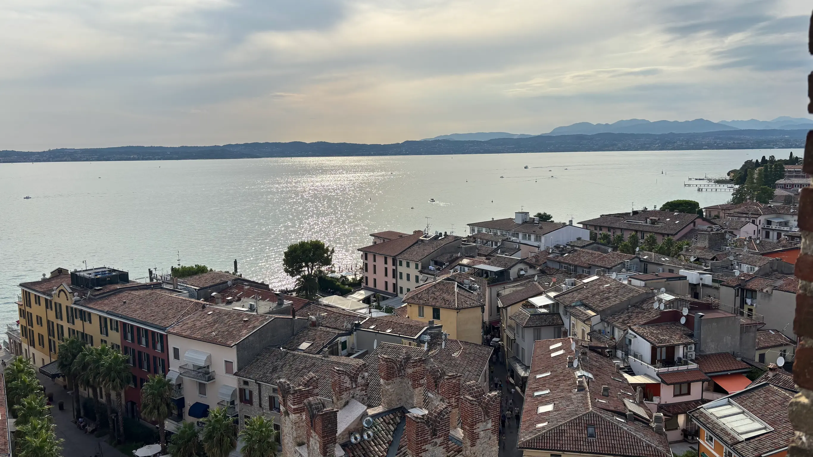
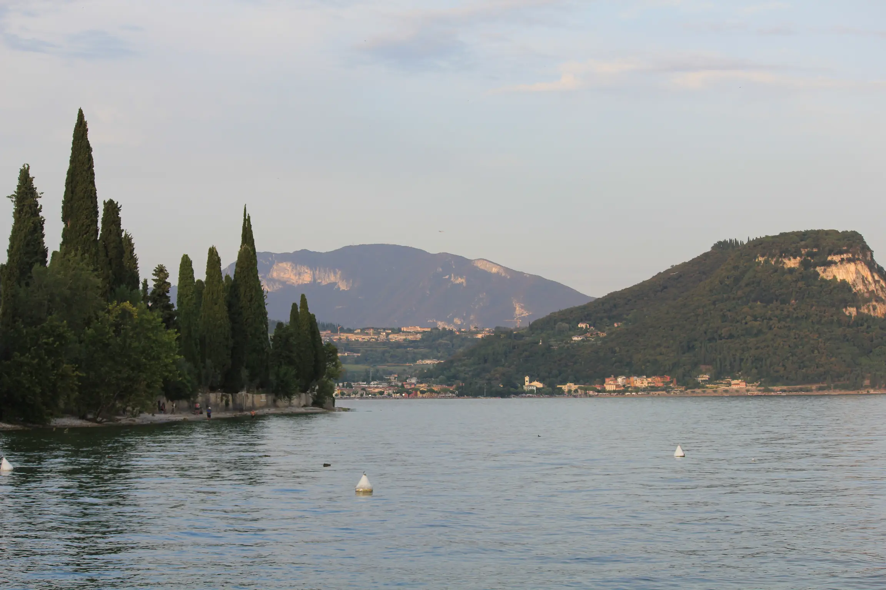
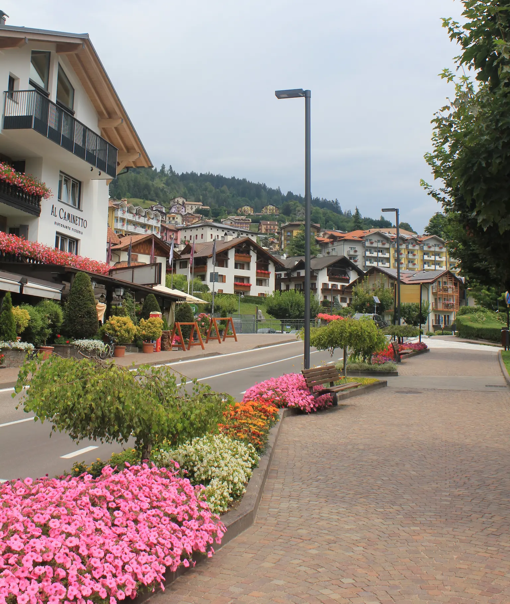
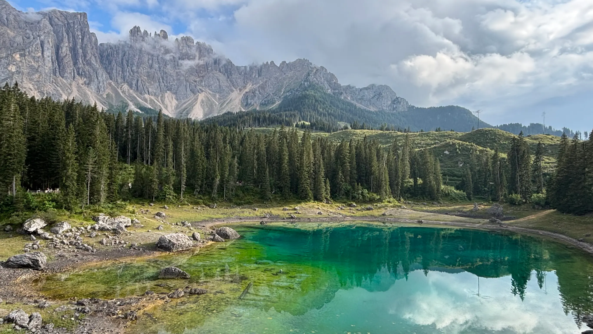
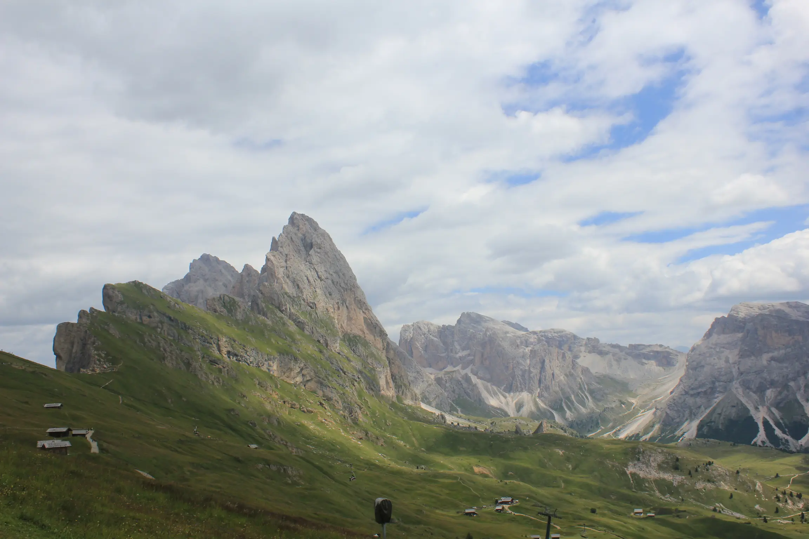
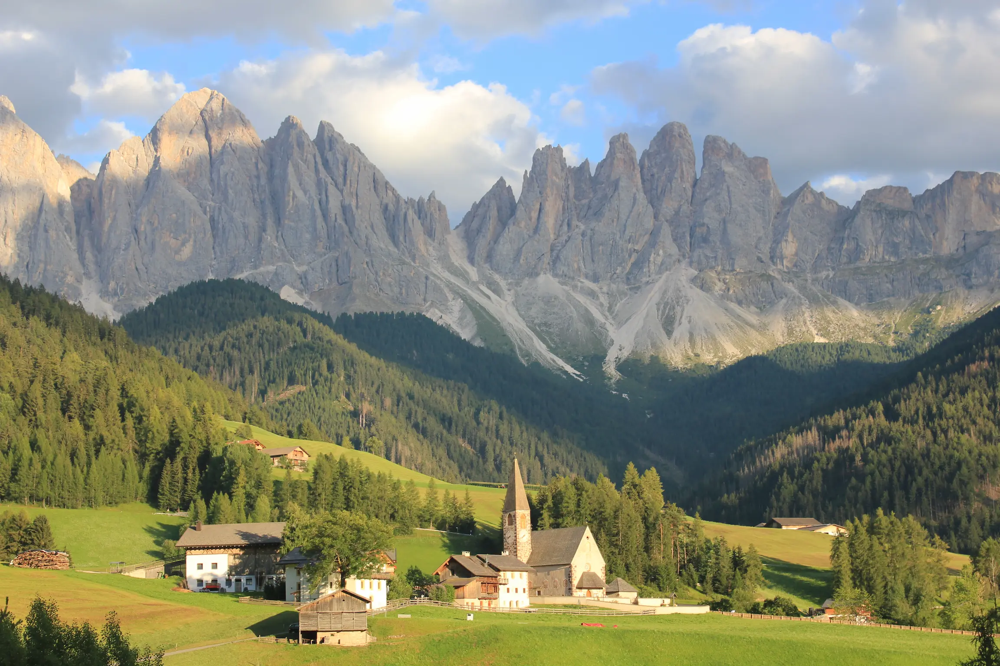
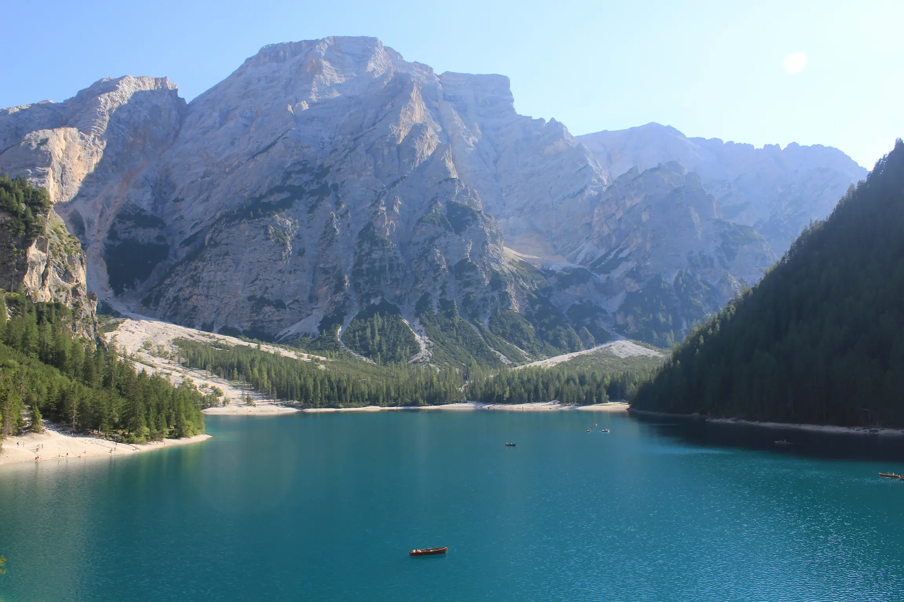
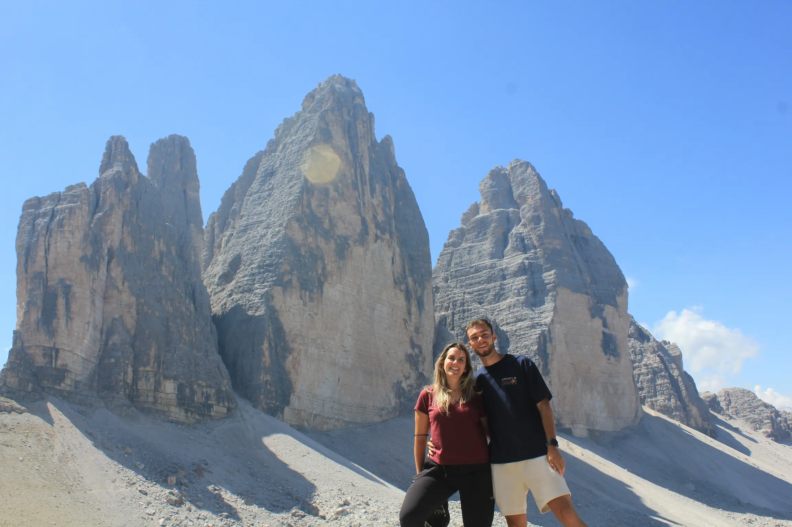
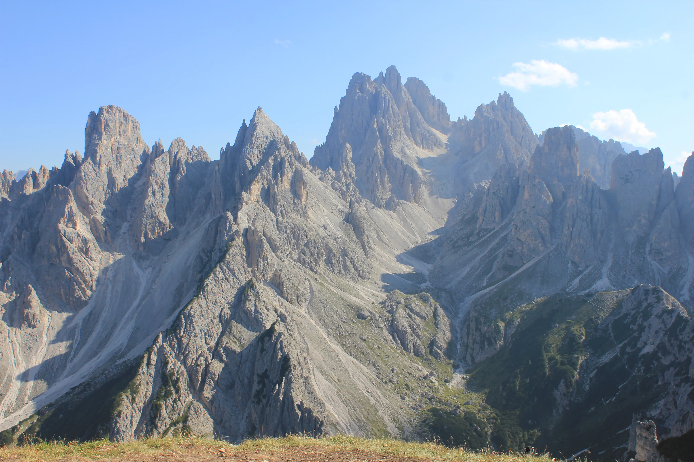
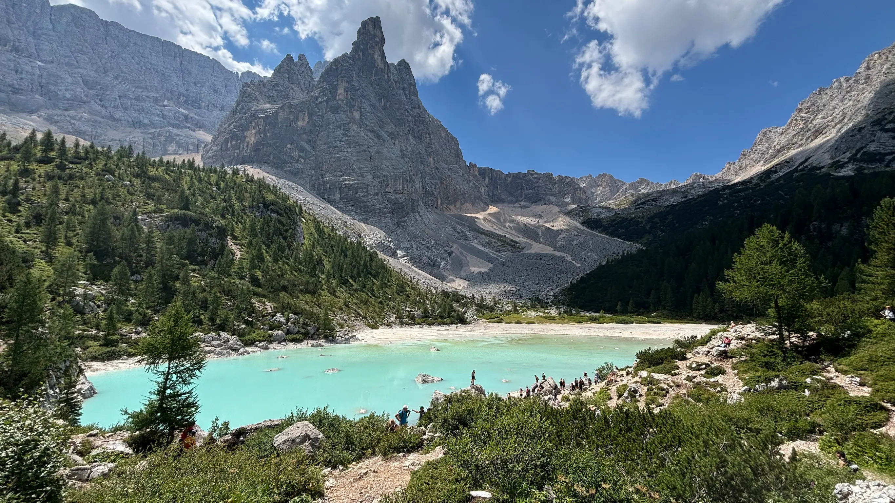

Las Dolomitas no se parecen a ninguna otra montaña de Europa. Tienen un paisaje único que te sorprenderá desde el primer día. Con seis días es imposible recorrerlas enteras, y conviene decirlo desde el principio. Lo que sí se puede hacer es una ruta muy bien resuelta que incluye los sitios más emblemáticos para dejarte con ganas de volver.

Este es el itinerario que hicimos nosotros, donde incluimos consejos prácticos para que aproveches tu viaje al máximo. Porque aquí el problema no es encontrar sitios bonitos, es llegar a ellos: en verano, media docena de los accesos más famosos tienen cupo o reserva previa, y descubrirlo a las nueve de la mañana delante de una barrera es el error más caro del viaje.

## Día 1: Lago de Garda, la antesala de las montañas

El primer día todavía no es montaña. La mayoría de vuelos aterrizan en Verona, Milán o Venecia. El lago de Garda queda de camino hacia el norte y así aprovechas la tarde en vez de quemarla conduciendo, merece mucho la pena.

La primera parada es Sirmione, un pueblo colgado del extremo de una península estrecha que se mete dos kilómetros dentro del lago. En él te esperan el castillo Scaligero, rodeado de agua por los cuatro costados, y las Grotte di Catullo, las ruinas de una villa romana en la punta de la península entre olivos y con el lago abierto de fondo.

> [!WARNING/Consejo para aparcar]
> Los aparcamientos en el casco histórico son bastante caros, y en verano son difíciles de encontrar. Lo mejor es aparcar en las afueras, donde hay una zona gratuita, y desde ahí caminar unos diez minutos hasta el bus lanzadera que te deja directamente en la parte turística.

Sigue por la orilla este hasta Garda, unos 25 kilómetros bordeando el agua. Es una parada corta: un paseo marítimo, un casco viejo de callejones y una plaza donde tomar el primer café italiano del viaje sin prisa.

A cinco minutos está Punta San Vigilio, y aquí va el consejo que marca la diferencia. Nosotros recomendamos bajar hasta el borde del lago, donde está el puertecito. Las vistas buenas están abajo, y además ahí mismo se aparca de sobra. Es ideal para ver la puesta de sol.

Cierra el día en Arco, a una hora de coche hacia el norte. Es un pueblo con un castillo medieval encaramado a una peña vertical y un arboreto con especies de medio mundo, nosotros dormimos aquí para empezar la ruta del día siguiente.

## Día 2: Molveno y el lago de Carezza

Este es el primer día de montaña. Desde Arco subes en algo menos de una hora hasta Molveno, un lago turquesa a 860 metros de altura encajado al pie de las Dolomitas de Brenta. Nosotros recomendamos dar una vuelta por el pueblo de Molveno antes de ver el lago, merece la pena.

Una vez en el lago, hay un montón de opciones para recorrerlo. La vuelta completa son unos 8 kilómetros, y se puede hacer en bici o andando. Nosotros hicimos parte de la vuelta andando, recorriendo los principales miradores que hay a lo largo del camino.

Después toca cruzar el valle del Adigio hasta el lago de Carezza. Es un lago pequeño, de agua verde esmeralda y completamente cristalina, con el macizo del Latemar reflejado justo detrás. Aunque es muy pequeño, sus colores y entorno lo hacen uno de los más bonitos de las Dolomitas.

Se aparca en la carretera de enfrente y se cruza por un paso subterráneo. El lago está vallado y se recorre entero por una pasarela en unos veinte minutos. El nivel del agua varía mucho a lo largo del verano, y con el lago bajo los reflejos no son los de las fotos. La luz de última hora de la tarde sobre el Latemar compensa igualmente.

## Día 3: Seceda y el Val di Funes

Si tuviéramos que elegir una sola imagen de las Dolomitas, probablemente sea esta. Seceda es una cresta a 2.500 metros de altitud que cae en vertical por un lado y baja en pradera suave por el otro, rodeada por un entorno de montaña espectacular.

Hay varias formas de subir hasta la cresta:

- Desde Ortisei, con el telecabina Seceda (74€ ida y vuelta). Es la opción más directa y rápida, te deja a 10 minutos andando del mirador.
- Desde Santa Cristina, con el telecabina Col Raiser (34€ ida y vuelta) y luego una hora andando hasta la cresta. Es más barato y te permite recorrer la cresta a pie.

Nosotros recomendamos el segundo. Es bastante más barato y te permite apreciar realmente las vistas durante toda la ruta e ir parando en los refugios.

Otra opción, y lo que hicimos nosotros, es pagar sólo el telecabina de subida y bajar andando hasta el aparcamiento. Es una caminata cómoda, todo en descenso (unos 1300m), con las Odle a la vista durante todo el recorrido. Desde la cresta al aparcamiento son unas 2 horas.

Por la tarde, a unos 37 kilómetros está Val di Funes, el valle que sale en todas las postales del Tirol del Sur. Aparca gratis junto a la iglesia de San Giovanni in Ranui, una capilla barroca de 1744 con cúpula de cebolla plantada sola en mitad de un prado y las Odle detrás.

La última parada es la iglesia de Santa Maddalena, a unos veinte minutos andando. Es el otro icono del Val di Funes, una iglesia con campanario puntiagudo sobre un montículo verde y la muralla de las Odle cerrando el horizonte. Nosotros recomendamos subir por el sendero panorámico de detrás del pueblo para ver la puesta de sol.

## Día 4: Lago di Dobbiaco y Lago di Braies

Día tranquilo, de esos que necesitas entre dos jornadas de montaña. La primera visita es el Lago di Dobbiaco, un lago alpino alargado rodeado de montañas. Tiene una vuelta llana de un par de kilómetros, y está permitido el baño. Eso sí, el agua está helada. Es un lago de deshielo, y en verano la temperatura máxima ronda los 15ºC.

El lago siguiente es el Lago di Braies, probablemente el lugar más fotografiado de todas las Dolomitas: agua verde intensa, un embarcadero de madera con barcas de remos y el Croda del Becco levantándose al fondo. Está a unos 20 minutos en coche de Dobbiaco.

La vuelta completa al lago son unos 3,5 kilómetros llanos que se hacen en hora y media. Merece la pena hacer la vuelta completa para ver el lago desde todos los puntos, ya que el paisaje cambia bastante.

Además, puedes alquilar unas barcas para dar un paseo por el lago, y está permitido el baño, aunque el agua aquí también está helada.

> [!WARNING/Importante sobre las reservas de aparcamiento]
> En verano sólo se puede acceder al aparcamiento con reserva previa hasta las 16:00, y las plazas vuelan. Nosotros fuimos a partir de las 16:00, cuando el acceso se libera. Ganas dos cosas, un aparcamiento sin reserva y un lago que se vacía de golpe en cuanto se marchan los autobuses del mediodía.

## Día 5: Tre Cime di Lavaredo y Cadini di Misurina

El día grande. Las Tre Cime di Lavaredo son tres torres de roca de más de 2.900 metros alineadas como si alguien las hubiera colocado a propósito, y dar la vuelta alrededor de ellas es la excursión más famosa de los Alpes orientales.

Se sube desde Misurina por una carretera hasta el Rifugio Auronzo, a 2.320 metros. En verano sólo se puede acceder con reserva previa (40€), y las plazas se pueden acabar. Nosotros recomendamos pagarlo, ya que si no la ruta sería demasiado, y encontrar aparcamiento en los pueblos de alrededor es bastante complicado.

La ruta completa circular son entre 4 y 4 horas y media a ritmo tranquilo, saliendo desde el Rifugio Auronzo. La primera parte es un camino ancho y cómodo, con vistas a las torres desde todos los ángulos. La segunda parte es más estrecha y con algo de desnivel, pero no tiene gran dificultad técnica.

Al terminar la ruta, queda lo mejor. Desde el mismo aparcamiento empieza el sendero hacia el mirador de Cadini di Misurina, entre una hora y hora y media ida y vuelta. Es un camino cómodo y llano casi todo, que desemboca en una repisa desde la que ves un bosque de agujas grises encajadas unas detrás de otras.

## Día 6: Lago di Sorapis

Último día, y lo cerramos con la caminata más bonita de la ruta. El Lago di Sorapis está a 1.925 metros de altitud, encajado en un circo de paredes bajo el Dito di Dio, y tiene un color turquesa que no parece real.

Se sale del Passo Tre Croci, donde hay aparcamiento gratuito. La ruta son entre 4 y 4 horas y media ida y vuelta, con una dificultad algo elevada. No tiene mucho desnivel, pero atraviesa varios tramos estrechos tallados en la pared, con cables y alguna escalerilla metálica. No requiere experiencia, pero sí ir preparado.

Arriba está el Rifugio Vandelli, buen sitio para comer algo antes de volver. Date tiempo junto al lago: la luz cambia mucho a lo largo de la mañana y el color pasa del azul lechoso al verde según le dé el sol. Es un cierre perfecto para el viaje.

Desde Cortina hay unas dos horas hasta el aeropuerto de Venecia y unas dos horas y media hasta Verona, así que si vuelas al día siguiente puedes dormir por la zona sin agobios.

## Consejos para conducir y aparcar en las Dolomitas

En las Dolomitas, la planificación no va de rutas, va de aparcamientos. Los sitios que necesitan gestión previa en verano son el **Lago di Braies**, con reserva obligatoria hasta las 16:00, y las **Tre Cime di Lavaredo**, con reserva de parking de 40€.

El resto de paradas de este itinerario tienen aparcamiento, tanto de pago como gratuito (nomalmente a las afueras de los pueblos). En todos los casos conviene llegar temprano para encontrar plaza, sobre todo en temporada alta.

Sobre la conducción, las carreteras están impecables, pero son puertos de montaña con curvas cerradas, autocaravanas delante y ciclistas por todas partes. Ojo también con las ZTL, las zonas de tráfico restringido de los cascos históricos italianos: en Sirmione, Arco o Cortina están señalizadas y se controlan por cámara, y la multa te llega a casa meses después.

## Cuándo visitar las Dolomitas

Este itinerario es un itinerario de verano, y no admite mucha discusión. La ventana buena va de mediados de mayo a mediados de septiembre, cuando los puertos están abiertos, los refugios funcionan, los telecabinas operan a diario y los senderos altos están libres de nieve.

En invierno las Dolomitas siguen siendo espectaculares, pero son otro viaje: esquí, carreteras de acceso cerradas (la de las Tres Cimas entre ellas) y una logística completamente distinta. No intentes adaptar esta ruta al invierno.

## Conclusión

Seis días en las Dolomitas dan para mucho más de lo que parece sobre el mapa, y aún así te vas con la sensación de haber visto una esquina, porque los valles que dejas sin pisar dan para otros tres viajes.

Si quieres alargarlo, Verona y Venecia quedan de camino a los aeropuertos, y son una buena opción para alargar tu viaje uno o dos días.

Si te apetece hacer esta ruta pero no quieres pelearte con reservas, gestiones y horarios, **estamos aquí para ayudarte**. [Escríbenos](/contacto) y organizamos juntos tu viaje a las Dolomitas a tu medida.
