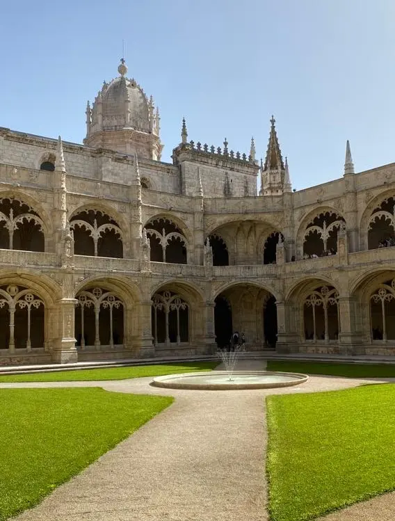
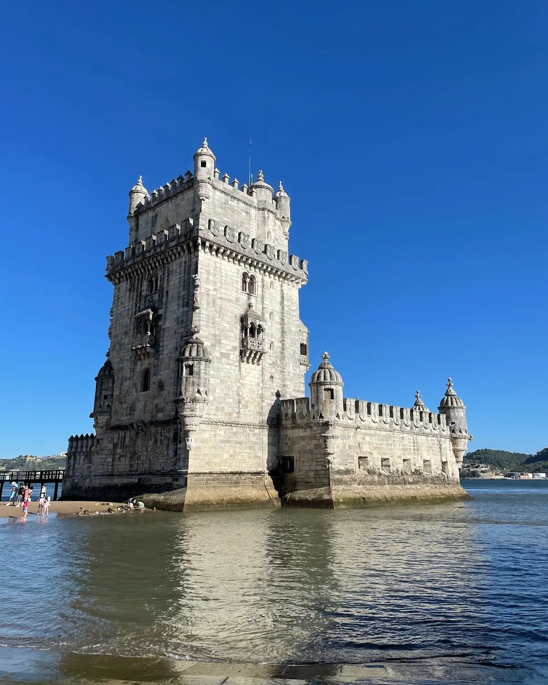
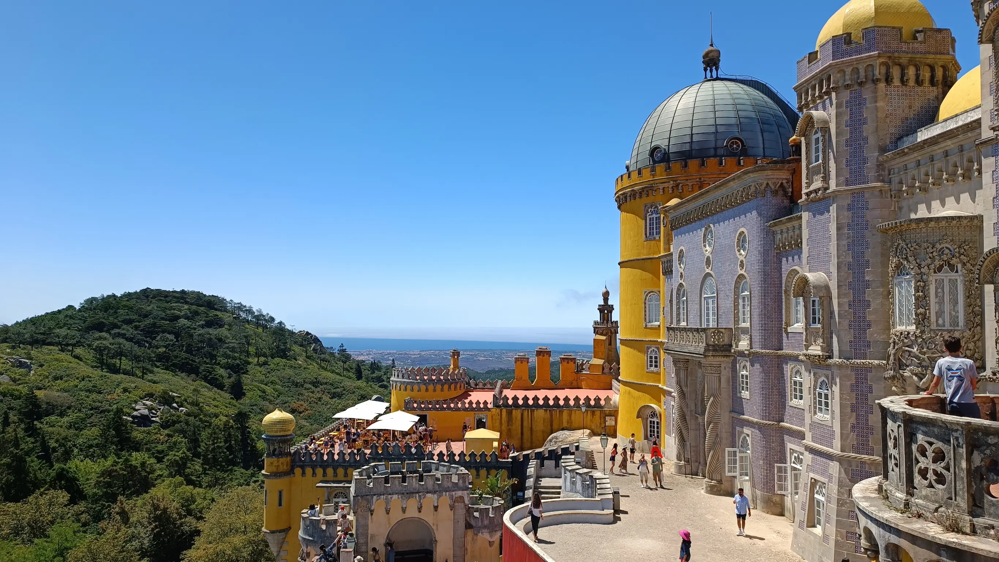
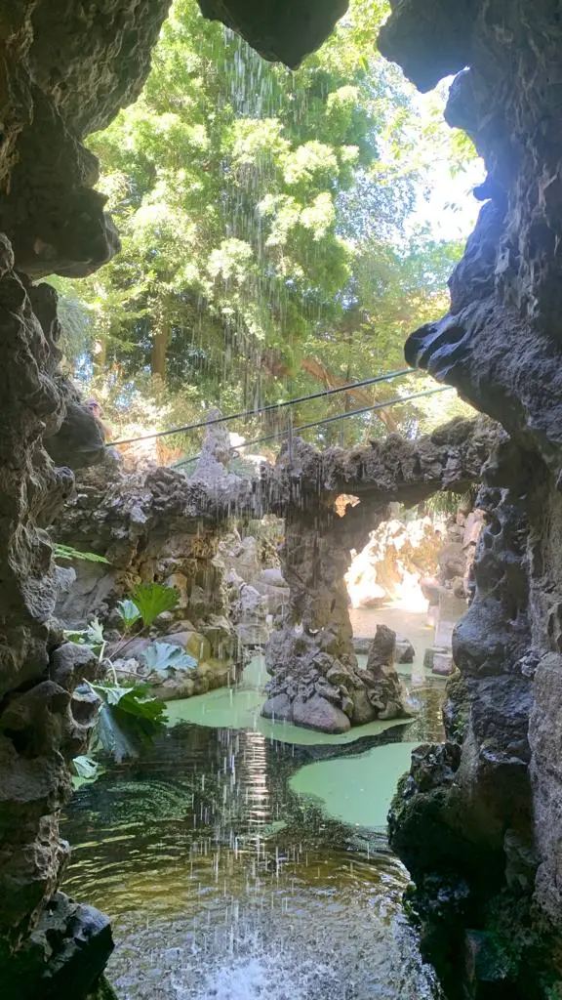
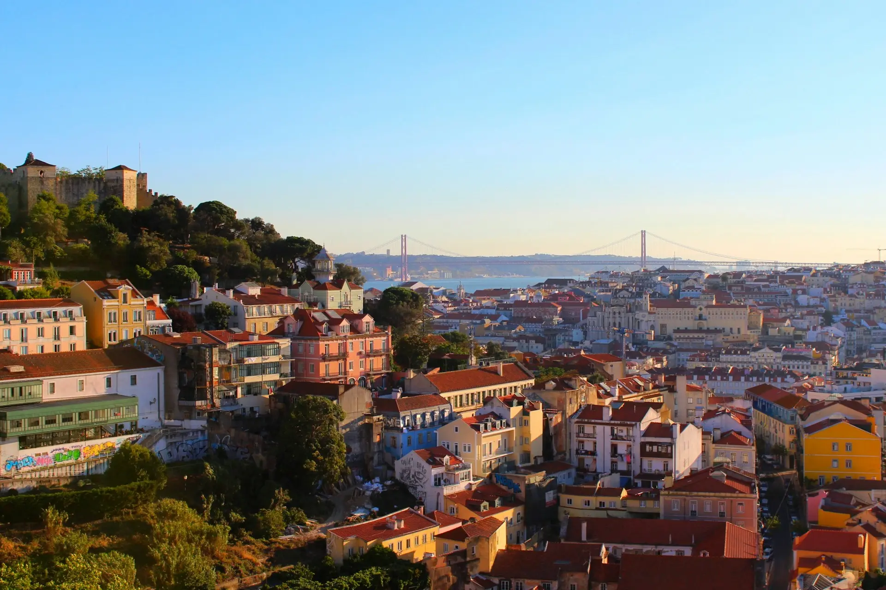

Lisboa es una ciudad de cuestas, tranvías y miradores, y eso condiciona el viaje mucho más de lo que parece sobre el mapa. Cuatro días dan de sobra para ver lo importante, incluida una excursión completa a Sintra, siempre que aceptes una cosa desde el principio: aquí no se camina en línea recta, se sube y se baja.

Este es el itinerario que hicimos nosotros, con los consejos prácticos que nos habría gustado tener antes de ir. Porque en Lisboa el problema no es qué ver, es a qué hora verlo: media docena de los sitios más famosos tienen entrada con franja horaria o colas de una hora, y descubrirlo delante de la taquilla es la forma más rápida de perder media mañana.

## Día 1: Alfama, el castillo y la Baixa

Empieza por Alfama, el barrio más antiguo de la ciudad y el único que sobrevivió entero al terremoto de 1755. Es un laberinto de callejuelas empinadas, escaleras y fachadas de azulejos con la ropa tendida entre balcones. La mejor forma de llegar arriba es en el Tranvía 28 desde Martim Moniz, bajando en las Portas do Sol.

Ese es el orden que recomendamos: subir en tranvía y bajar andando. Al revés acabas subiendo cuestas de verdad, y en verano eso pesa.

> [!WARNING/El Tranvía 28 a la hora equivocada]
> Entre las 10:00 y las 17:00 la cola en Martim Moniz supera la hora y el tranvía va tan lleno que no ves nada por la ventana. Si te pilla a media mañana, coge el **12E**: hace un recorrido muy parecido por Alfama y va mucho más descargado.

Bájate en el Mirador de las Portas do Sol, con Alfama y el Tejo abiertos delante. Justo al lado está el Mirador de Santa Luzia, más pequeño, con una pérgola de buganvillas y paneles de azulejos. Desde ahí lo mejor es no seguir ningún mapa y dejarse caer por las calles del barrio hacia abajo.

De camino queda la Sé de Lisboa, la catedral románica de 1147, que parece más una fortaleza que una iglesia. Y arriba, el Castillo de San Jorge, la antigua alcazaba mora desde la que se ve toda la ciudad. Calcula una hora y media entre murallas, torres y jardines.

Por la tarde baja a la Baixa, el barrio que reconstruyeron tras el terremoto con calles en cuadrícula. Recorre la Rua Augusta hasta la Praça do Comércio, la plaza grande abierta al río, y sube al Arco de la Rua Augusta si quieres otra panorámica. El Elevador de Santa Justa, el ascensor neogótico de 1902, tiene siempre una cola larga para lo que ofrece: se llega a la misma plataforma andando desde el Largo do Carmo, y gratis.

Nosotros lo hicimos por la tarde del primer día y encaja perfectamente con este itinerario: por la mañana ves Alfama y el castillo por tu cuenta, y por la tarde el tour te resuelve la Baixa y el Chiado con contexto. También sirve para pillar ideas de sitios donde comer el resto de días.

Cierra el día cenando en Alfama. Si te apetece fado en vivo, reserva mesa: las casas de fado buenas se llenan, y las que aceptan gente sin reserva suelen ser las turísticas.

## Día 2: Belém y los monumentos manuelinos

El segundo día es Belém, el barrio a orillas del Tejo desde donde salieron las carabelas en los siglos XV y XVI. Está a unos 30 minutos en el tranvía 15 desde Praça do Comércio, con el trayecto pegado al río. Es un día entero, pero de los cómodos: todo está a distancia caminable y es llano.

Empieza a primera hora en el Mosteiro dos Jerónimos, la obra maestra del manuelino portugués y Patrimonio de la Humanidad. Lo que hay que ver es el claustro de dos pisos, con la piedra tallada con motivos marinos, cuerdas y esferas armilares. En la iglesia, que se entra aparte y es gratuita, están las tumbas de Vasco da Gama y Camões.

Conviene reservar la entrada online con franja horaria. Es el sitio con más cola de todo Belém, y en temporada alta se pasa fácilmente de una hora esperando en la calle. Dedícale hora y media larga.

A diez minutos andando por el paseo del río está la Torre de Belém, el otro icono de la ciudad. Es una torre fortificada de principios del siglo XVI que se construyó dentro del cauce y hoy queda pegada a la orilla, porque el terremoto y los rellenos cambiaron el río. Por dentro es pequeña, con una escalera de caracol estrecha y de sentido único que se atasca enseguida.

Nosotros recomendamos verla por fuera con marea baja, cuando se puede bajar a la playa y rodearla. Nosotros entramos, pero no lo recomendamos mucho, hay bastante cola y no tiene nada especial dentro.

Entre los dos monumentos está la Antiga Confeitaria de Belém, donde hacen los pastéis de nata originales desde 1837 con una receta que todavía no ha salido de la casa. Merece mucho la pena visitar la tienda y probar los pastéis, son una de las mejores cosas que nos llevamos de Lisboa.

Para terminar, el Padrão dos Descobrimentos, el monumento de 52 metros con forma de proa y Enrique el Navegante a la cabeza. Se puede subir al mirador de arriba en ascensor, pero tampoco merece mucho la pena, hay mejores vistas desde otros sitios que mencionamos más abajo.

## Día 3: Excursión a Sintra

El tercer día es Sintra, y es el día que hay que planificar de verdad. Está a 40 minutos en tren desde la estación de Rossio, con salidas cada 20 o 30 minutos, y es una excursión de jornada completa.

Para nosotros, este fue el mejor día del viaje. Sintra es un lugar de cuento, los palacios y las quintas están plantados en lo alto de la sierra, rodeados de bosque y niebla, y la villa tiene un centro histórico con calles empedradas y casas de colores.

> [!WARNING/Reserva las entradas de Sintra con días de antelación]
> El **Palacio da Pena** vende entrada con hora de acceso y se agota. En verano y en puentes puede estar completo con una semana de antelación, así que sácala en la web oficial con tiempo. Lo mismo con la **Quinta da Regaleira**, aunque esa suele tener más disponibilidad.

Desde la estación, el autobús 434 sube en circuito hasta el Castelo dos Mouros y el Palacio da Pena. Es la forma cómoda de salvar la subida, pero no es barato para lo que es, y en hora punta se llena y hay que esperar al siguiente.

El Palacio da Pena es la primera parada. Es un palacio romántico del siglo XIX pintado en amarillo, rojo y morado, con cúpulas, almenas y azulejos mezclados sin ningún pudor, plantado en lo alto de la sierra. Los interiores conservan la decoración original de la familia real.

Reserva dos o tres horas, porque el parque que lo rodea son 200 hectáreas de bosque con senderos y miradores, y la caminata desde la puerta hasta el palacio ya es un buen rato cuesta arriba. Si no quieres andar, hay una lanzadera dentro del recinto.

Baja después al centro histórico para el Palacio Nacional, el de las dos chimeneas cónicas gigantes que se ven desde toda la villa. Es el palacio real más antiguo que se conserva en Portugal, y sus salas de azulejos, la de los Cisnes y la de las Urracas, son lo mejor de la visita.

Por la tarde, la Quinta da Regaleira, que para nosotros es lo más interesante de Sintra. Es un palacio neogótico rodeado de un jardín lleno de simbología masónica, con grutas, túneles y pasadizos que conectan unos con otros por debajo de tierra.

Lo famoso es el Pozo Iniciático, una escalera de caracol que baja 27 metros por nueve niveles y desemboca en los túneles. Nosotros recomendamos hacerlo en sentido de bajada y salir por las grutas hasta el lago de la cascada, que es la parte que casi nadie recorre entera.

## Día 4: Bairro Alto, Chiado y miradores

El último día es el de los barrios de arriba y las vistas. Empieza en el Bairro Alto, que de día es un barrio tranquilo de tiendas pequeñas, galerías y cafés, y de noche es el epicentro de la fiesta de la ciudad. Se sube en el Ascensor da Glória desde la Praça dos Restauradores, uno de los funiculares amarillos que son tan de Lisboa como los tranvías.

Arriba está el Mirador de San Pedro de Alcántara, con el castillo enfrente al otro lado del valle. Desde ahí se baja andando al Chiado, el barrio elegante. Pasa por la librería Bertrand, que abrió en 1732 y es la más antigua del mundo en funcionamiento, y por el Café A Brasileira, donde está la estatua de Fernando Pessoa sentado en la terraza.

Muy cerca están las ruinas del Convento do Carmo, y son una parada corta que merece la pena. El terremoto de 1755 le tiró el techo y se decidió dejarlo así: quedan los arcos góticos abiertos al cielo, y es de los pocos sitios del centro donde se entiende de golpe la escala de aquel terremoto.

Por la tarde toca la ruta de miradores, que en Lisboa es un plan en sí mismo. El de la Senhora do Monte es el más alto de la ciudad y el que tiene la panorámica más completa. El de la Graça, a cinco minutos, tiene un quiosco con mesas donde la gente del barrio se toma una cerveza al atardecer, y es donde recomendamos quedarse cuando empieza a bajar el sol.

Si prefieres cambiar de ambiente, el LX Factory en Alcântara es una antigua fábrica convertida en complejo de tiendas, librerías y restaurantes bajo el puente 25 de Abril. Queda a desmano del resto del itinerario, así que es una tarde entera o nada.

Cierra el viaje cenando en una tasca de Alfama o del Bairro Alto, con una ginjinha después. Es un licor de guinda que se sirve en vasito de chocolate y se toma de un trago; el sitio clásico es Ginjinha Sem Rival, junto a Rossio, que es poco más que una barra en la que no cabe nadie.

## Cómo moverse por Lisboa

Lisboa se recorre andando, pero con ayuda. Las siete colinas no son una forma de hablar, y hay tramos en los que el transporte público no es comodidad sino sentido común. Hay metro, autobuses, tranvías, funiculares y ferris por el Tejo, todo con el mismo sistema de billete.

Lo práctico es comprar una tarjeta recargable Navegante (la que antes se llamaba Viva Viagem) y cargarle un pase de 24 horas. Incluye metro, bus, tranvía y funiculares, así que se amortiza con tres o cuatro viajes. Comprar el billete suelto a bordo del tranvía cuesta bastante más que llevarlo cargado en la tarjeta.

El metro es rápido pero no llega a casi ningún sitio turístico; úsalo para el aeropuerto y para distancias largas. Para Belém, el tranvía 15. Para subir a los barrios altos, los funiculares Glória, Bica y Lavra. Y la Lisboa Card, que incluye transporte y entradas a varios monumentos, sale a cuenta solo si vas a encadenar museos de pago varios días seguidos: con este itinerario, echa la cuenta antes de comprarla.

Dos avisos. El primero, los carteristas: el Tranvía 28 lleno, los miradores concurridos y la zona de Rossio son donde pasa. El segundo, el suelo. La calçada portuguesa, esos adoquines pulidos, resbala muchísimo cuando llueve o cuando está desgastada. Lleva calzado con suela de agarre, no zapatillas de suela lisa.

## Cuánto cuesta un viaje a Lisboa

Lisboa sigue siendo de las capitales baratas de Europa occidental, pero ha subido mucho en los últimos años y ya no es la ganga que era. El alojamiento es lo que más se ha disparado, y los barrios de Graça, Mouraria o Alcântara salen bastante mejor de precio que Baixa o Chiado sin quedar lejos del centro.

Las entradas de los monumentos principales son el otro gasto serio del viaje. Contando Jerónimos, la Torre de Belém, el castillo, la Pena y la Regaleira, se va un buen pellizco por persona solo en visitas, así que merece la pena decidir de antemano en cuáles entras de verdad y cuáles ves por fuera. Los miradores, que son media ciudad, son todos gratuitos.

Los precios de las entradas y de los transportes cambian casi cada temporada, así que confírmalos en las webs oficiales antes de reservar: es fácil encontrarse cifras desactualizadas en las guías, incluida esta.

## Cuándo visitar Lisboa

La mejor época es la primavera, de marzo a junio, y el principio del otoño, de septiembre a octubre. Hay temperatura para caminar cuestas todo el día, las colas son más llevaderas y la luz de Lisboa, que es de las cosas que justifican el viaje, está en su mejor momento.

Julio y agosto son otra cosa: calor, colas en todo y precios de alojamiento altos. Si vas en verano, organiza el día con los monumentos a primera hora y los miradores por la tarde. Junio tiene una excepción que compensa: las fiestas de los Santos Populares, cuando Alfama se llena de sardinas a la brasa y calles decoradas.

El invierno es suave, con unos 15 grados de máxima, y la ciudad se vacía de turistas. A cambio llueve más, y con las cuestas mojadas y la calçada resbalando el itinerario se hace bastante más incómodo.

## Conclusión

Cuatro días en Lisboa dan para lo importante y para una excursión a Sintra, que es lo que hace que el viaje merezca la pena de verdad. Y aun así te vas con cosas pendientes como Cascais, Óbidos, la costa de Sintra o simplemente volver a los mismos miradores a otra hora del día.

Si quieres alargarlo, con un día más entra Cascais u Óbidos, y con dos se puede subir a Oporto en tren y hacer un viaje de norte a sur.

Si te apetece hacer esta ruta pero no quieres pelearte con entradas, franjas horarias y horarios de tren, **estamos aquí para ayudarte**. [Escríbenos](/contacto) y organizamos juntos tu viaje a Lisboa a tu medida.
