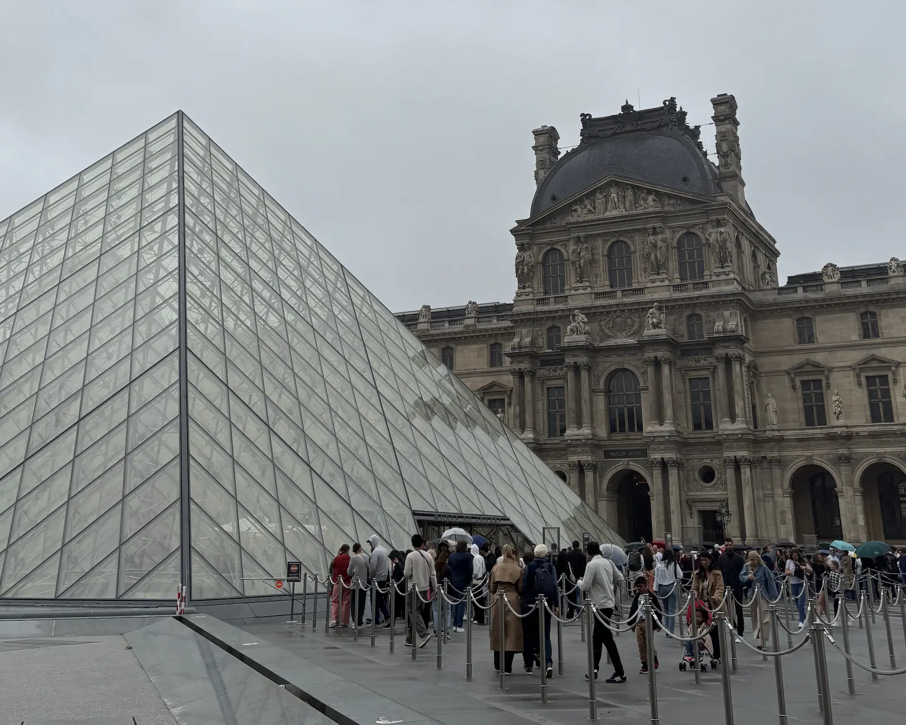
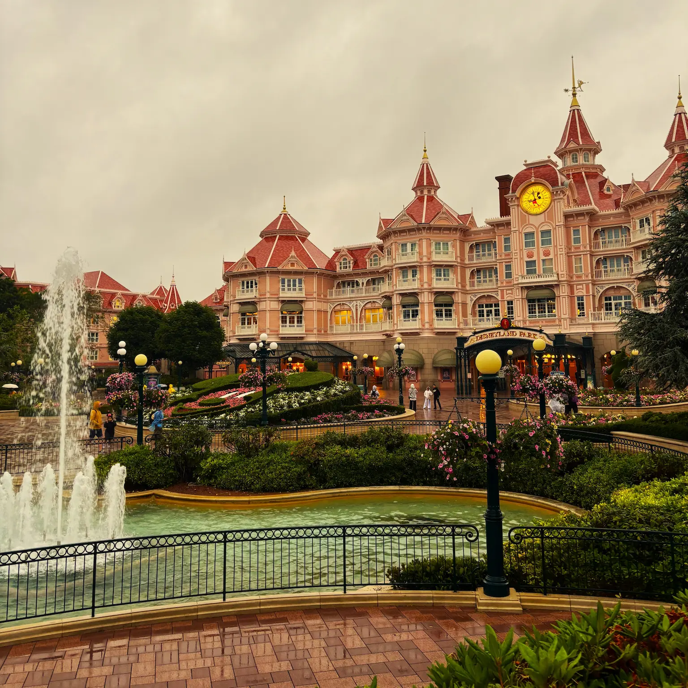
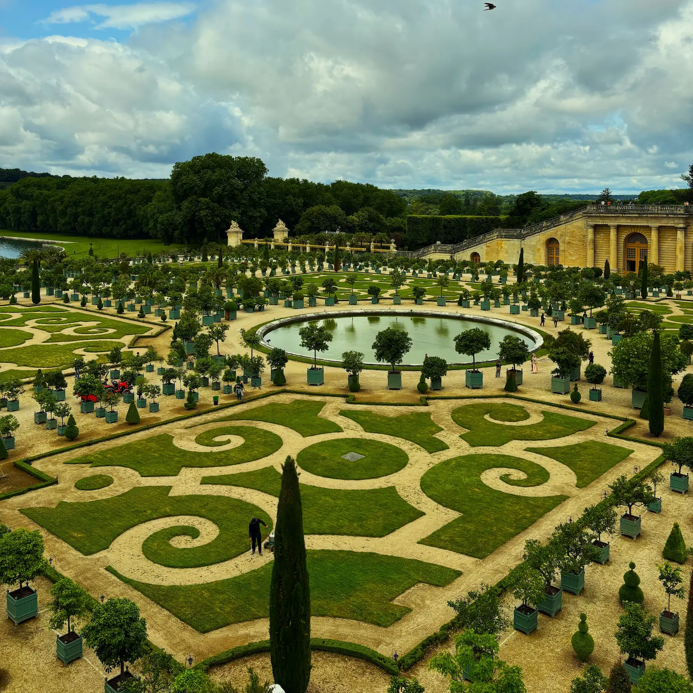
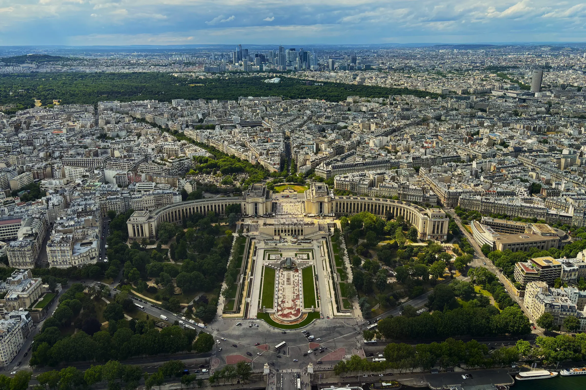
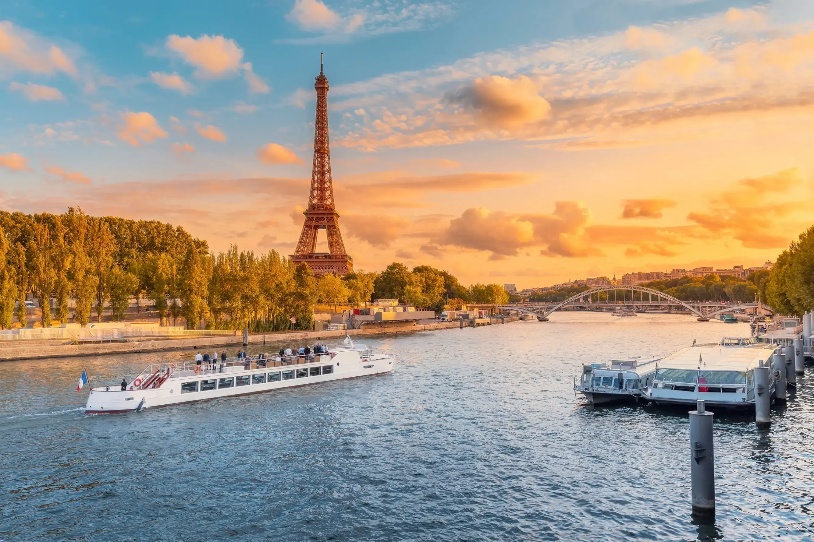

París es de esas ciudades que parecen fáciles de organizar hasta que te pones. Todo está bien comunicado, todo se puede ver y todo tiene entrada, y precisamente por eso se acaba montando un itinerario imposible. Con cuatro días se ve lo importante de sobra, siempre que aceptes una cosa desde el principio: aquí no se trata de encajar más sitios, sino de encajarlos en el orden correcto.

Este es el itinerario que hicimos nosotros, con los consejos prácticos que nos habría gustado tener antes de ir. Y conviene decirlo ya: dos de los cuatro días salen de la ciudad, uno a Disneyland y otro a Versalles. Eso deja el centro de París en dos jornadas, que dan para los imprescindibles, pero no para pasear sin rumbo. Si prefieres lo segundo, quita Disneyland y respira.

Porque en París el problema no es qué ver, es a qué hora y con qué reserva: los sitios más famosos venden entrada con franja horaria y se agotan con semanas de antelación, y descubrirlo delante de la taquilla es la forma más rápida de perder una mañana entera.

## Día 1: el Louvre, Notre-Dame y el Barrio Latino

El primer día empieza temprano en el Louvre. Es el museo más grande del mundo y el error clásico es intentar verlo entero: nosotros recomendamos entrar con una idea clara de tres horas, el ala Denon como columna vertebral y las antigüedades egipcias si sobra tiempo.

Dentro, la Gioconda tiene su propia cola dentro de la sala y se ve tres minutos entre móviles. Merece la pena verla una vez y no volver a pensar en ella: la Victoria de Samotracia en lo alto de la escalera, la Venus de Milo y las salas de pintura francesa dan mucho más por el tiempo invertido.

> [!WARNING/El Louvre es la única entrada que no puedes dejar para el día de antes]
> Es entrada con **franja horaria obligatoria** y las mejores horas vuelan. Reserva la primera de la mañana en la web oficial, y entra por el **Carrousel du Louvre**, el acceso subterráneo desde la Rue de Rivoli: es la misma entrada y te ahorra la cola de la pirámide de la foto. Ojo, el museo **cierra los martes**.

Al salir, cruza el Sena por el Pont des Arts y sigue por la Île de la Cité hasta Notre-Dame, reabierta en diciembre de 2024 tras el incendio. La entrada es gratuita, pero se sacan reservas de acceso en la web oficial con pocos días de antelación, y eso es lo que separa entrar en diez minutos de esperar una hora larga en la plaza. La piedra limpia del interior no se parece nada a las fotos de antes del incendio, y ese contraste es medio motivo de la visita.

Desde ahí se sube andando al Barrio Latino, que es donde se pasa el resto del día. De camino queda la librería Shakespeare and Company, justo enfrente de la catedral al otro lado del río, y las callejuelas de alrededor de Saint-Séverin.

La parada larga de la tarde es el Jardín de Luxemburgo. Es el parque más bonito de París y funciona como el salón del barrio, con sillas verdes de metal que puedes mover donde quieras, el palacio del Senado al fondo, el estanque con los barquitos de vela y gente echando la tarde.

A cinco minutos está el Panteón, que cierra el día. Por dentro está el péndulo de Foucault y, en la cripta, las tumbas de Victor Hugo, Marie Curie o Alexandre Dumas. La entrada se compra allí mismo sin problema, y de abril a octubre incluye la subida a la columnata de la cúpula, para nosotros uno de los mejores miradores de la ciudad y de los menos conocidos.

## Día 2: Disneyland Paris

El segundo día sale de la ciudad entero. Si viajas con niños, es probablemente el que más recuerden del viaje; si viajas sin ellos, es un día que se disfruta igual, pero conviene saber que no vas a pisar París hasta la noche.

Se llega en el RER A hasta Marne-la-Vallée–Chessy, unos 40 minutos desde Châtelet, y la estación deja justo en la entrada. Son dos parques: el Disneyland Park, el de la calle principal y el castillo, y el segundo, dedicado al cine y en plena remodelación desde hace un par de años. Con un solo día, nuestra recomendación es quedarse en el primero y no intentar los dos.

Compra la entrada online y con fecha cerrada, que es bastante más barata que en taquilla, y llega media hora antes de la apertura. Los primeros noventa minutos valen por toda la tarde: las atracciones grandes se hacen casi sin cola mientras la mayoría de la gente sigue haciéndose fotos en Main Street. Deja esas fotos para el final del día.

Nosotros fuimos con lluvia, y aunque no era el plan, acabó siendo el mejor día posible para ir: se vacían las colas, los desfiles siguen saliendo y el parque se queda a media capacidad. Si el pronóstico da agua, lleva chubasquero en lugar de cambiar de planes.

Quédate al espectáculo nocturno sobre el castillo, que es el mejor momento del día, y luego coge el RER de vuelta justo cuando termine o espera veinte minutos a que pase la avalancha. Ten en cuenta que el tren es de cercanías y a esas horas va lleno de gente que vuelve del parque, así que calcula una hora larga de puerta a puerta.

## Día 3: Versalles, el Arco del Triunfo y la Torre Eiffel

Este es el día grande del viaje, y también el más largo. Empieza en Versalles, que está a unos 40 minutos en el RER C desde el centro, bajando en la estación Château de Versailles Rive Gauche, y desde ahí son diez minutos andando hasta la verja dorada.

Ve a primera hora. El palacio funciona como un embudo: entre las 11:00 y las 14:00 la Galería de los Espejos se recorre en fila india y no se disfruta de nada. Entrando a la apertura, las salas de Estado y la galería se ven casi sin gente, y para cuando llegan los autobuses tú ya estás en los jardines.

Y los jardines son la mitad buena de la visita. Son 800 hectáreas de perspectivas, bosquetes, fuentes y parterres diseñados por Le Nôtre, con el Gran Canal cruzando el eje central. Bajo la terraza sur está el parterre de la Orangerie, con sus naranjos en maceta alineados alrededor del estanque, y al fondo del parque el Trianón y el Hameau de la Reine, la aldea de casitas donde María Antonieta se escapaba de la corte.

Hasta el Trianón hay unos dos kilómetros desde el palacio, así que con este itinerario ajustado nosotros recomendamos dejarlo fuera y quedarte con el palacio y los jardines de la parte central. Dos avisos: **Versalles cierra los lunes**, y los fines de semana de abril a octubre hay espectáculo de fuentes musicales, que está muy bien pero convierte el acceso a los jardines en entrada de pago.

> [!WARNING/Este día solo funciona si sales de Versalles a mediodía]
> Es un día encadenado, y el cuello de botella está aquí. Si a las **14:00** no has cogido el RER de vuelta, llegas tarde a todo lo demás y te quedas sin crucero. Nosotros entramos a la apertura, vimos palacio y jardines sin pausa y comimos ya de vuelta en París.

De regreso, baja en Champ de Mars o Invalides y coge el metro hasta Charles de Gaulle-Étoile, porque la segunda mitad del día se hace entera andando. La primera parada es el Arco del Triunfo, con su terraza y la vista de la estrella de doce avenidas desde arriba, que es la mejor forma de entender por qué esta ciudad se recorre en diagonal. La entrada se compra en la taquilla de abajo, aunque a última hora de la tarde suele haber cola.

Y no intentes cruzar la rotonda: es de las más caóticas de Europa y no tiene paso de peatones. Al arco se llega por un paso subterráneo señalizado que sale desde la acera de los Campos Elíseos, junto a la salida del metro.

Desde ahí, la Avenida Kléber baja recta hasta el Trocadéro en un cuarto de hora. En la explanada del Palacio de Chaillot es donde está la foto de París que tienes en la cabeza, con la torre enfrente y sin nada en medio. Es también el mejor sitio para esperar a que caiga la luz.

Cruza el Sena y sube a la Torre Eiffel. El recinto está vallado y hay control de bolsos, así que calcula un rato de cola incluso llevando la entrada. Hay tres niveles: el primero con suelo de cristal, el segundo con las mejores vistas de detalle y la cima, a 276 metros, desde la que se entiende de golpe cómo está trazada la ciudad.

Nosotros compramos la entrada allí mismo y salió bien, pero no es lo que recomendamos: en temporada alta la subida en ascensor a la cima se agota y la cola de taquilla es de las peores de la ciudad. Si no reservas, el plan B bueno es el ticket de escaleras hasta el segundo piso, que es más barato, tiene mucha menos cola y son 674 escalones que se hacen mejor de lo que suenan.

El día se cierra en el Sena. Los cruceros de una hora salen del embarcadero del pie de la torre y del Pont de l'Alma, y el que hay que coger es el último de la noche: ves Notre-Dame, el Louvre y los puentes iluminados, y sobre todo ves la torre desde el agua cuando destella, cinco minutos en punto de cada hora. Es el mejor momento del viaje y no hace falta reservar con antelación, se compra en el propio embarcadero.

## Día 4: Montmartre, los grandes bulevares y el Orsay

El último día se hace entero andando, de norte a sur, y es el que más se parece a pasear por París sin plan. Empieza arriba, en Montmartre. El funicular de la Rue Foyatier cuesta lo que un billete de metro y te ahorra la escalinata, aunque subir andando por las calles laterales del barrio es bastante más bonito.

El Sacré-Cœur es de entrada gratuita y no suele tener cola a primera hora. Su cúpula se sube por 300 escalones estrechos y da la panorámica más alta de París después de la torre, con la ventaja de que aquí sí ves la propia torre en el encuadre. Después, el barrio se recorre sin mapa: la Place du Tertre con los retratistas, el viñedo del Clos Montmartre, La Maison Rose y el Mur des Je t'aime.

> [!WARNING/La estafa de las pulseras en el Sacré-Cœur]
> En las escaleras que suben a la basílica hay gente que te agarra la muñeca "de regalo", te ata una pulsera de hilo y después te reclama veinte o treinta euros con bastante insistencia. **No pares y no des la mano.** Es el timo más habitual de la ciudad, junto con el del anillo de oro en los muelles del Sena.

Baja hacia los grandes bulevares y para en las Galerías Lafayette. Aunque no vayas a comprar nada, la cúpula de vidrieras de 1912 sobre el atrio central merece los diez minutos, y sobre todo la terraza de la última planta: es de acceso gratuito y tiene la Ópera Garnier justo debajo, con la torre al fondo. Es uno de los miradores gratis mejores de París y mucha gente pasa por debajo sin saberlo.

Sigue bajando hasta el jardín del Palacio Real, que es el contraste perfecto con la calle de la que vienes. Es un patio ajardinado cerrado por arcadas, con hileras de tilos, dos fuentes y un silencio que no parece del centro de París. En la parte de delante están las Columnas de Buren, el campo de columnas de rayas blancas y negras por el que se pasea todo el mundo.

De ahí a la Plaza de la Concordia hay un paseo corto por las Tullerías. Es la plaza más grande de la ciudad, con el obelisco de Luxor de 3.000 años en el centro y las dos fuentes monumentales, y sobre todo con la mejor perspectiva del eje: los Campos Elíseos subiendo hasta el Arco del Triunfo por un lado, el Louvre por el otro.

Baja al río y cruza el Puente Alejandro III, el más recargado de París, con sus farolas art nouveau y las cuatro columnas doradas. Está alineado con la cúpula de Los Inválidos y es el sitio donde más gente se para a hacer fotos con razón. Desde ahí, la orilla te lleva en quince minutos al Museo de Orsay.

El Orsay es una antigua estación de tren de 1900 convertida en museo, y tiene la mejor colección de impresionistas del mundo: Monet, Renoir, Degas, Van Gogh. Es bastante más manejable que el Louvre, se ve bien en dos horas y la planta de arriba, la de los relojes de la antigua estación, es lo que hay que ver aunque solo te dé tiempo a eso.

Además tiene una particularidad que conviene conocer: es gratuito para los menores de 26 años residentes en la UE y el primer domingo de cada mes para todo el mundo. En esos casos se entra sin reserva, por la fila de gratuidades y enseñando el DNI. Nosotros entramos así. Cierra los lunes y abre hasta la noche los jueves.

## Cómo moverse por París

El metro es la respuesta a casi todo. Son catorce líneas, pasa cada pocos minutos y no hay nada de este itinerario que quede lejos de una parada. Lo único que conviene entender es que dentro de la ciudad te mueves en metro, y para salir de ella (Versalles, Disneyland, los aeropuertos) se usa el RER, que es la red de cercanías y funciona por zonas.

Lo práctico es cargar una tarjeta Navigo Easy con billetes sueltos si vas a hacer pocos trayectos, o un pase diario si vas a encadenar muchos. Nosotros cogimos un pase de 3 días y nos salió a cuenta, aunque solo lo usamos para el día de Versalles y el de Disneyland.

Dicho esto, París se camina mucho mejor de lo que parece en el mapa. El día 3 y el día 4 son prácticamente andando, y entre parada y parada de metro suele haber cinco minutos a pie.

Por último, la opción del coche no la recomendamos para nada, ya que la ciudad está llena de zonas peatonales y alquilar un coche ralentizaría bastante el itinerario.

## Qué reservar antes de salir de casa

En París la planificación no va de rutas, va de entradas con hora. Estas son las que nosotros sacaríamos desde casa, todas en las webs oficiales:

- **Louvre**: franja horaria obligatoria.
- **Disneyland Paris**: entrada con fecha concreta, bastante más barata online que en taquilla.
- **Torre Eiffel**: la subida a la cima es la primera que se agota. Se puede comprar allí, pero puede que se agote.
- **Versalles**: entrada con hora para entrar a la apertura sin cola.
- **Notre-Dame**: gratuita, pero con reserva de acceso si no quieres esperar en la plaza.

Y ordena los días mirando los cierres, porque son la única restricción rígida del viaje. El **Louvre cierra los martes**, y **Versalles y el Orsay cierran los lunes**. Con este itinerario eso significa que el día 1 no puede caer en martes, ni el día 3 o el día 4 en lunes.

## Cuándo visitar París

La mejor época es la primavera, de abril a junio, y el principio del otoño, de septiembre a octubre. Hay temperatura para caminar todo el día, los jardines de Luxemburgo y de Versalles están en su mejor momento y las colas son más llevaderas que en pleno verano. La columnata del Panteón, además, solo abre de abril a octubre.

Julio y agosto son otra cosa: calor, colas en todo y precios de alojamiento altos. Y agosto tiene una particularidad muy parisina: la ciudad se va de vacaciones, y muchos bistrós de barrio, panaderías y tiendas pequeñas cierran semanas enteras, así que te queda abierta la parte turística y poco más.

El invierno funciona sorprendentemente bien si no te importa el frío. Los museos se disfrutan de verdad, Disneyland está mucho más vacío y los precios bajan, aunque anochece a las cinco y hay que reorganizar el día alrededor de eso.

## Conclusión

Cuatro días en París dan para los imprescindibles de la ciudad y para dos excursiones grandes, Disneyland y Versalles, que es exactamente lo que hicimos nosotros. Sale, pero con jornadas largas y sin mucho margen para improvisar, así que si viajas con niños pequeños o te gusta ir despacio, quita una de las dos y ganas un día entero de París.

Si quieres alargarlo, con un día más entran la Sainte-Chapelle, el Marais y el cementerio de Père-Lachaise; con dos, una excursión a Giverny, a Reims o a los castillos del Loira.

Si te apetece hacer esta ruta pero no quieres pelearte con entradas, franjas horarias y días de cierre, **estamos aquí para ayudarte**. [Escríbenos](/contacto) y organizamos juntos tu viaje a París a tu medida.
