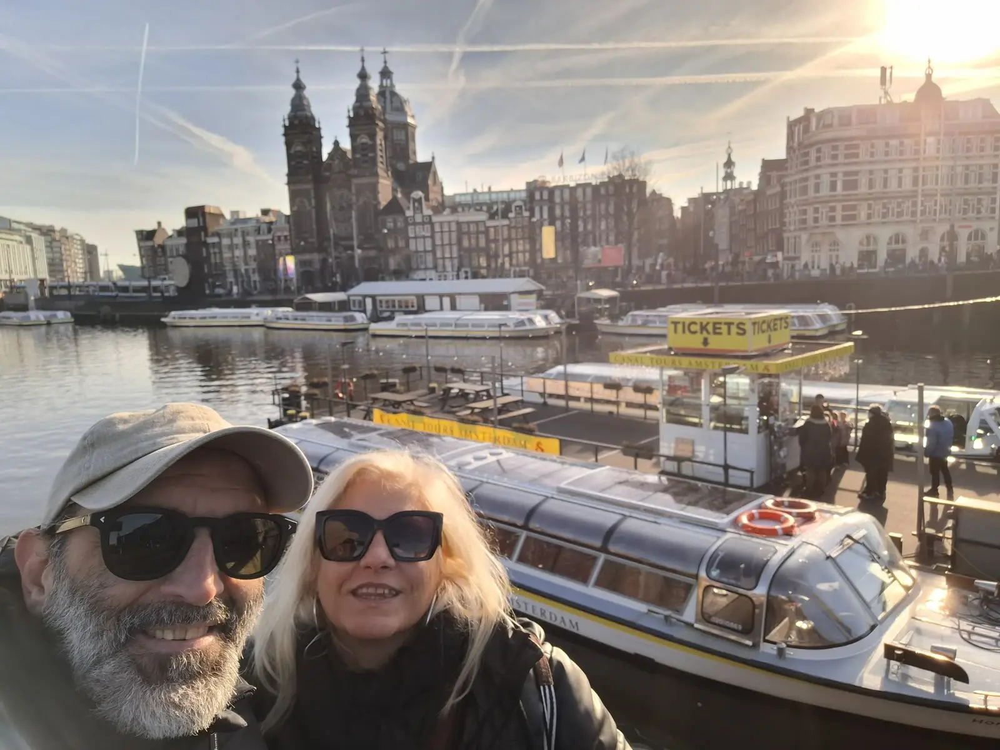
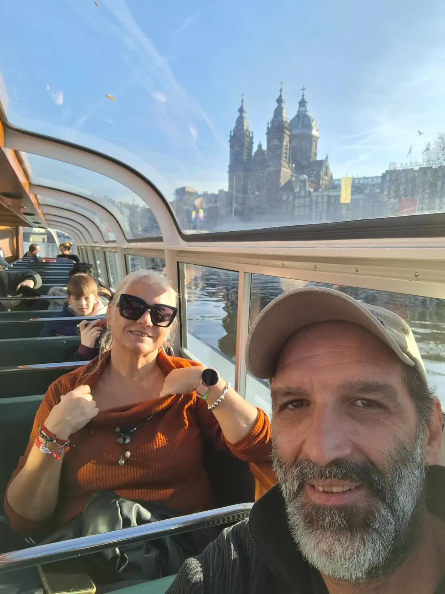

> Solo teníamos cuatro días y pensábamos que no nos daría tiempo a nada. Lucía y Lucas nos prepararon un plan tan bien pensado que vimos todo lo que queríamos sin ir corriendo a ningún sitio.

## Cuatro días y una lista de imprescindibles

Amparo y Emy tenían claro el destino y las fechas: cuatro días en Ámsterdam. Lo que no tenían claro era si les daría tiempo a ver la ciudad de verdad o si acabarían eligiendo entre unas cosas y otras.

El problema no era la distancia, porque el centro de Ámsterdam se recorre a pie casi entero. Era el calendario. La Casa de Ana Frank y el Museo Van Gogh venden entradas con franja horaria que se agotan semanas antes, los museos grandes piden media mañana como mínimo y, si las reservas caen en mal orden, se acaba cruzando la ciudad dos veces el mismo día para nada.

Se pusieron en contacto con nosotros con tiempo suficiente para reservar lo importante. Repasamos juntos qué les apetecía ver, con cuánto ritmo querían moverse y qué preferían dejar fuera, y a partir de ahí montamos el itinerario día a día.

## El itinerario

**Día 1 — El centro y el Jordaan.** Llegada por la mañana y primer contacto con la ciudad a pie: la Plaza Dam, el mercado de flores y las callejuelas del Jordaan, el barrio de los canales estrechos y las casas inclinadas. Cerramos el día con un crucero por los canales, embarcando junto a la basílica de San Nicolás con el sol ya bajo.

**Día 2 — Museumplein.** El día grande de los museos. El Rijksmuseum por la mañana, con tiempo de sobra para la Ronda de noche y las salas de los maestros holandeses, y el Museo Van Gogh por la tarde, a cinco minutos andando. Las dos entradas, reservadas con antelación y en franjas consecutivas para no perder el día entre una y otra.

**Día 3 — Ana Frank y la ciudad tranquila.** Primera hora en la Casa de Ana Frank, que es cuando mejor se visita, y el resto de la mañana por el Begijnhof y los canales del anillo. Por la tarde, bicicleta y un rato largo en el Vondelpark, que es lo más parecido a ver Ámsterdam como la ven quienes viven allí.

**Día 4 — Molinos y vuelta.** Excursión a Zaanse Schans, a menos de media hora de la ciudad: molinos de viento en funcionamiento, casas de madera verde y talleres de queso y zuecos. Vuelta a Ámsterdam con margen de sobra para el vuelo.

## El resultado

Cuatro días dan para mucho en Ámsterdam si las visitas están bien encajadas. Amparo y Emy vieron todo lo que llevaban en la lista, sin colas, sin madrugones innecesarios y con tiempo para sentarse en una terraza junto a un canal, que al final es de lo que más se acuerda uno.

